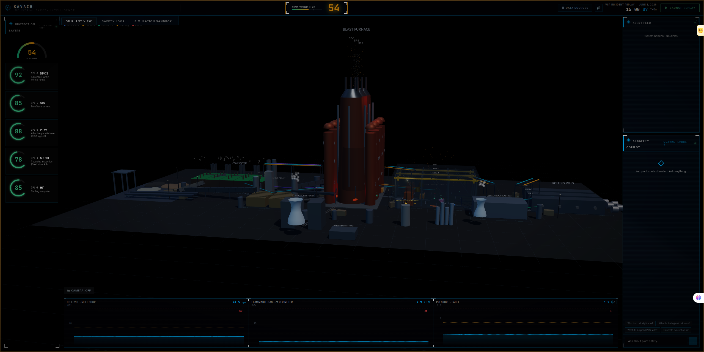
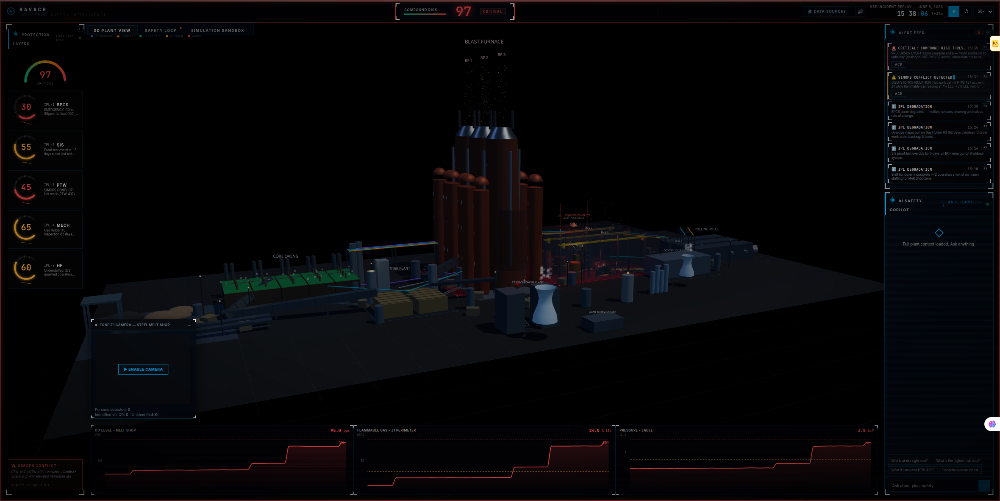
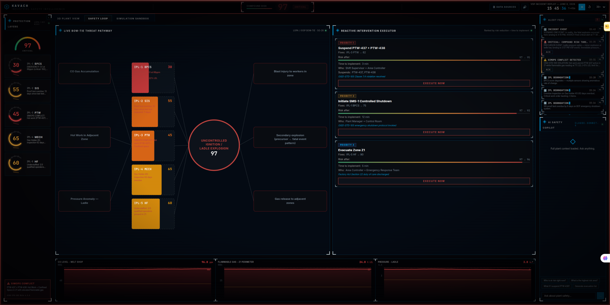
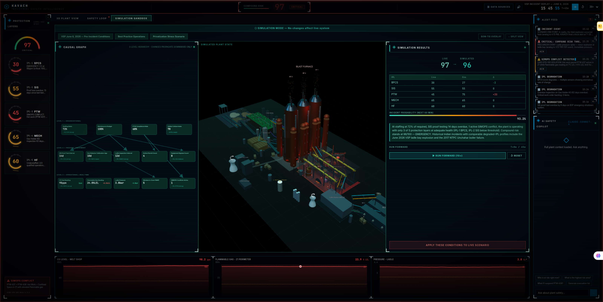
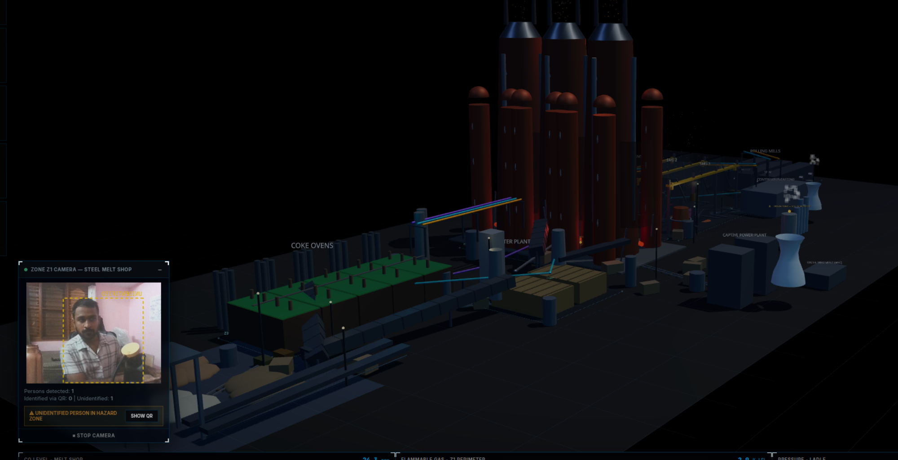
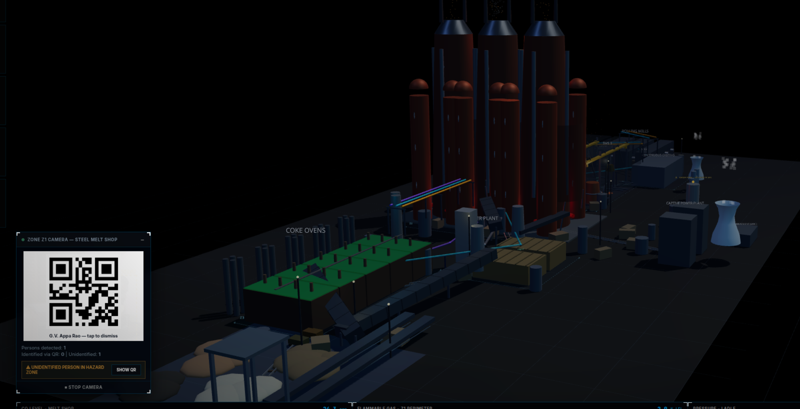

# KAVACH

<div align="center">

```
██╗  ██╗ █████╗ ██╗   ██╗ █████╗  ██████╗██╗  ██╗
██║ ██╔╝██╔══██╗██║   ██║██╔══██╗██╔════╝██║  ██║
█████╔╝ ███████║██║   ██║███████║██║     ███████║
██╔═██╗ ██╔══██║╚██╗ ██╔╝██╔══██║██║     ██╔══██║
██║  ██╗██║  ██║ ╚████╔╝ ██║  ██║╚██████╗██║  ██║
╚═╝  ╚═╝╚═╝  ╚═╝  ╚═══╝  ╚═╝  ╚═╝ ╚═════╝╚═╝  ╚═╝
```

### `INDUSTRIAL SAFETY INTELLIGENCE PLATFORM`


</div>

---

<div align="center">

```
┌─────────────────────────────────────────────────────────────────┐
│  INCIDENT LOG — VISAKHAPATNAM STEEL PLANT                       │
├─────────────────────────────────────────────────────────────────┤
│  [ 06.08.2026 · 15:57 ]  First explosion. Warning signal.       │
│                           Unconnected to any action.            │
│  [ 06.08.2026 · 16:15 ]  Fatal explosion. Nine workers dead.    │
│  [ DELTA: 18 MINUTES  ]  The sensors worked.                    │
│                           The data existed.                     │
│                           The intelligence layer did not.       │
├─────────────────────────────────────────────────────────────────┤
│  STATUS  ►  KAVACH would have fired at 16:07 · 8 min before     │
└─────────────────────────────────────────────────────────────────┘
```

</div>

---

## The Problem

Indian heavy industry loses **3 workers every day** in registered factories alone. Across 7 major incidents analysed — VSP 2026, Sigachi 2025, LG Polymers 2020, NTPC Unchahar 2017, IOC Jaipur 2009 — the pattern is identical:

```
  DATA EXISTS        ✓
  SENSORS READING    ✓
  WARNINGS PRESENT   ✓
  LIVES SAVED        ✗  ←  no system connected them
```

- **86%** of incidents had administrative control (PTW) failure
- **70–93%** of the dead were contract workers — invisible to every existing safety system
- **Zero** of the 7 incidents were truly unwarned
- **2–4 hours** median detectable warning window — wasted every time

KAVACH closes that gap.

---

## What Makes This Different

```
EXISTING PLATFORMS           KAVACH
─────────────────────────    ──────────────────────────────────────
Monitor sensors          →   Monitors barriers
Single threshold alarm   →   Compound LOPA formula (IEC 61511)
Fires when 1 trips       →   Fires when multiple layers degrade
Post-incident logs       →   Pre-incident intervention
Contract workers: N/A    →   Named · located · training-verified
```

The mathematics:

```
Compound Risk  =  100 × (1 − ∏(IPL score / 100))

  IPL-1 BPCS  :  30  ─┐
  IPL-2 SIS   :  55  ─┤
  IPL-3 PTW   :  45  ─┼─→  Compound Risk: 97  →  CRITICAL
  IPL-4 MECH  :  65  ─┤     (every individual sensor: "acceptable")
  IPL-5 HF    :  60  ─┘
```

This is the Swiss Cheese alignment. This is what kills workers. This is what KAVACH detects.

---

## Screenshots

### `[ 01 ]` 3D Plant Intelligence View — Nominal · Risk: 54

> The real Visakhapatnam Steel Plant reconstructed in 3D — coke ovens, blast furnaces, steel melt shop, rolling mills. Five IPL dials live. Compound risk: 54. System breathing.

### `[ 02 ]` Critical Alert — Risk: 97 · CRITICAL

> KAVACH detected compound failure at T+35. Real fatal explosion: T+45. **Ten minutes of intervention time.** Edge lighting red. Emergency alarm active. 7 alerts in feed.

### `[ 03 ]` Safety Loop — Live Bow-Tie · Intervention Executor

> Barrier width = real-time IPL health score. Barriers thin as IPLs degrade. Execute Now — barrier restores, risk drops 97→61, resolution sound fires, evidence auto-logged.

### `[ 04 ]` Simulation Sandbox — Causal Graph · Run Forward

> Privatisation Stress Scenario: staffing 45%, maintenance 60%. Compound risk 95 — **zero process anomaly.** Purely from organisational decisions. The accident was seeded weeks before any sensor tripped.

### `[ 05 ]` Camera Intelligence — Live Person Detection

> TensorFlow.js COCO-SSD running in-browser. Unidentified person in hazard zone → immediate alert → IPL-5 degrades → compound risk rises.

### `[ 06 ]` QR Worker Identification

> QR scan confirms identity instantly — name, employer, training status against zone hazard class. Minimum viable deployment: a printed QR and any smartphone.

---

## Five Pillars

### `01` Real-Time LOPA Engine

Five Independent Protection Layers scored continuously. Compound risk recalculates every few seconds. When multiple barriers degrade simultaneously — even when no single sensor crosses its threshold — KAVACH fires.

| IPL | Name | What It Monitors | Live Data Source |
|-----|------|-----------------|-----------------|
| IPL-1 | BPCS | Gas, pressure, temperature **trend velocity** | SCADA / OPC-UA historian |
| IPL-2 | SIS | Proof test interval, bypass/override status | Maintenance records |
| IPL-3 | PTW | PHSA completion, SIMOPS conflicts per OISD-STD-105 | Permit-to-work log |
| IPL-4 | MECH | Overdue inspections, open critical work orders | CMMS / SAP PM |
| IPL-5 | HF | Qualified operators vs. required, contractor training | Shift roster + training DB |

### `02` SIMOPS Conflict Engine

Detects prohibited simultaneous operations per **OISD-STD-105** — the actual Indian regulatory standard for work permit systems. Hot work within 30m of confined space entry. Ignition source in elevated flammable gas zone. Deterministic, explainable, directly mapped to Indian regulation.

### `03` Contractor Workforce Visibility

Contract workers are **70–93% of Indian industrial fatalities** yet invisible to every existing system. KAVACH's QR check-in gives every contractor a live digital identity — name, employer, training status verified against zone hazard class. Evacuation list auto-generates on alert including every contractor by name. Language-aware safety briefings: Telugu · Hindi · Odia · Bengali.

### `04` Live Bow-Tie + Intervention Executor

The IOGP-standard, Ministry of Steel SG-26 mandated bow-tie analysis — made live. Barrier width driven by real-time IPL health score. Three ranked interventions with **projected compound risk after execution**. Click Execute — barrier restores, risk drops, resolution alarm fires, evidence logged.

### `05` Regulatory Evidence Auto-Preservation

Every critical alert auto-generates a timestamped evidence bundle formatted for **DGFASLI / Factory Inspectorate submission under Factory Act Section 88** — sensor readings, active permits, worker locations, officer decisions. The accountability layer Indian industry has never had.

---

## Simulation Sandbox

```
LEVEL 1 — ORGANISATIONAL  (root causes · changes cascade downward)
┌─────────────────┐  ┌──────────────────┐  ┌─────────────────────┐
│  Staffing Ratio │  │ Maintenance Bdgt │  │ PTW Compliance Rate │
└────────┬────────┘  └────────┬─────────┘  └──────────┬──────────┘
         └───────────────────┴────────────────────────┘
                              ↓
LEVEL 2 — PROCESS / EQUIPMENT  (intermediate barriers)
┌───────────────────┐  ┌──────────────────────┐  ┌──────────────────┐
│ SIS Proof Test    │  │ Gas Detector Calib.  │  │ Ladle Inspection │
└────────┬──────────┘  └──────────┬───────────┘  └────────┬─────────┘
         └───────────────────────┴─────────────────────────┘
                              ↓
LEVEL 3 — OPERATIONAL / REAL-TIME  (immediate conditions)
┌──────────────┐  ┌──────────────────┐  ┌───────────────┐  ┌──────────────┐
│ CO Gas (ppm) │  │ Flammable Gas LEL│  │ Ladle Pressure│  │ Workers/Zone │
└──────────────┘  └──────────────────┘  └───────────────┘  └──────────────┘
                              ↓
               ┌────────────────────────┐
               │   COMPOUND RISK SCORE  │
               │   5-IPL LOPA ENGINE    │
               └────────────────────────┘
```

| Preset | What It Models | Simulated Risk |
|--------|---------------|----------------|
| `VSP June 8, 2026 — Pre-Incident` | Exact conditions 45 min before real explosion | 54 → 97 |
| `Best Practice Operations` | Full staffing, all proof tests current | ~18 · SAFE |
| `Privatisation Stress Scenario` | VSP post-workforce-reduction | ~95 · zero process anomaly |

---

## Camera Intelligence Layer

```
Webcam / plant CCTV
        │
        ▼
TensorFlow.js COCO-SSD (in-browser · no backend)
        ├──→  Person count → IPL-5 HF update → risk recalculation
        │
        ▼
jsQR detection → worker identity → training status check
        │
        ├── training CURRENT  →  worker dot on 3D map (cyan)
        └── training EXPIRED  →  alert fires · IPL-5 degrades · risk rises
```

---

## Technology Stack

| Layer | Technology |
|-------|-----------|
| Frontend | React 18 + TypeScript |
| 3D Visualization | React Three Fiber · Three.js r128 · @react-three/drei |
| State Management | Zustand |
| Charts | Recharts |
| Computer Vision | TensorFlow.js COCO-SSD · jsQR |
| AI Copilot | Anthropic claude-sonnet-4-6 (context-injected · streaming) |
| Safety Engine | Real-time LOPA (IEC 61511) · OISD-STD-105 SIMOPS rules |
| Ambient UX | Web Audio API · CSS edge lighting |

---

## Getting Started

```bash
git clone https://github.com/your-username/kavach.git
cd kavach
npm install
echo "VITE_ANTHROPIC_API_KEY=your_key_here" > .env
npm run dev
```

```
CONTROLS
────────────────────────────────────────
LAUNCH REPLAY   →  start VSP incident scenario
Space           →  pause / resume
R               →  reset to T+0
1 / 2 / 3       →  jump to scenario checkpoints
```

---

## Data Architecture

```
┌──────────────────────────────────────────────────────┐
│                   DATA INPUT LAYERS                  │
├─────────────────────┬────────────────────────────────┤
│  Process Signals    │  OPC-UA historian (read-only)   │
│  → IPL-1 BPCS       │  MQTT · Modbus TCP              │
├─────────────────────┼────────────────────────────────┤
│  Work Permits       │  ePTW REST API                  │
│  → IPL-3 PTW        │  Paper PTW → Claude Vision OCR  │
├─────────────────────┼────────────────────────────────┤
│  Workforce          │  QR check-in · RFID             │
│  → IPL-5 HF         │  Live camera CV (TF.js)         │
├─────────────────────┼────────────────────────────────┤
│  Equipment Health   │  SAP PM · IBM Maximo · CMMS     │
│  → IPL-4 MECH       │  Manual maintenance entry       │
└─────────────────────┴────────────────────────────────┘
                          ↓
            ┌─────────────────────────┐
            │    5-IPL LOPA ENGINE    │
            │  Compound Risk Score    │
            │  recalculates every ~2s │
            └─────────────────────────┘
                          ↓
        ┌─────────────────────────────────────┐
        │  Alert Feed · Bow-Tie · Evidence    │
        │  AI Copilot · Evacuation List       │
        └─────────────────────────────────────┘
```

---

## Deployment Path

```
Phase 1 — 72 hours ──────────────────────────────────────────────
  OPC-UA read-only + QR check-in + manual PTW entry
  Any plant. Any digitisation level. No hardware changes.
  Full five-pillar compound risk monitoring live from day one.

Phase 2 — 30 days ───────────────────────────────────────────────
  ePTW API + CMMS connector + live camera CV
  Multilingual briefings: Telugu · Hindi · Odia · Bengali

Phase 3 — 6 months ──────────────────────────────────────────────
  Multi-plant via JSON config
  P&ID upload → Claude Vision → new plant onboarded < 1 hour
  SAIL: 5 plants. One conversation. Five deployments.
  Cost of one fatality (Rs 2–5 Cr) > annual SaaS per plant
```

---

## The Research Foundation

```
137 DEATHS  ·  7 INCIDENTS  ·  17 YEARS  ·  ONE PATTERN
```

| Incident | Year | Fatalities | Warning Gap | IPL Failures |
|----------|------|-----------|-------------|-------------|
| VSP Visakhapatnam Steel Plant | 2026 | **9** | 18 minutes | PTW · BPCS · HF |
| Sigachi Industries, Telangana | 2025 | **46** | Hours | All 5 IPLs |
| LG Polymers Styrene Leak, Vizag | 2020 | **13** | Days | SIS · PTW · MECH · BPCS · HF |
| NTPC Unchahar Boiler Explosion | 2017 | **45** | Hours | PTW · SIS · MECH · BPCS · HF |
| IOC Jaipur Vapour Cloud Explosion | 2009 | **11** | 75 minutes | PTW · SIS · BPCS |
| Neyveli Boiler Explosion | 2020 | **6+** | Hours | BPCS · MECH |
| IOC Hazira Welding Fire | 2013 | **3** | Minutes | PTW · MECH |

**Zero of the 7 incidents were truly unwarned.** Every fatality had a detectable compound precursor. KAVACH makes those warnings actionable.

---

## Built For

**ET AI Hackathon 2.0** — Problem Statement 1: AI-Powered Industrial Safety Intelligence for Zero-Harm Operations

**By:** Chanikya Sai Nelapatla

---

<div align="center">

```
┌─────────────────────────────────────────────────────┐
│                                                     │
│   Sensors tell you when something went wrong.       │
│                                                     │
│   Barriers tell you when something is about         │
│   to go wrong — and give you time to stop it.       │
│                                                     │
│   VSP had working sensors on June 8, 2026.          │
│                                                     │
│   Nine workers still died.                          │
│                                                     │
└─────────────────────────────────────────────────────┘
```

</div>
